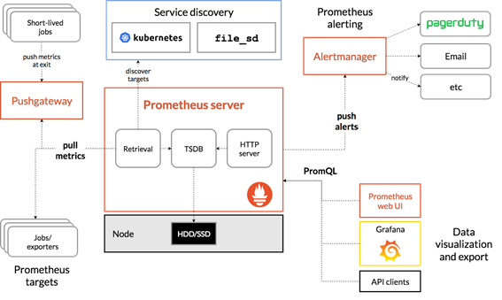
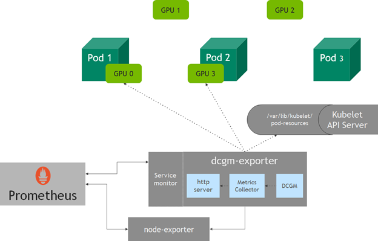

# GPU弹性伸缩指南

GPU自动缩放通过Data Center GPU Manager(DCGM)暴露GPU利用率作为Prometheus自定义指标,并根据此指标执行水平自动缩放。

* DCGM exporter收集GPU指标,并通过基于Prometheus自定义指标的HPA扩展pod 
* 使用集群自动缩放器或Karpenter实现GPU集群的自动缩放


## NVDA DGCM
NVDA DGCM是用于在大规模基于Linux的集群环境中管理NVIDIA GPU的一组工具。它可以监控大规模基于Linux集群环境中的NVIDIA GPU。这是一种低开销的工具,可以执行各种功能,包括活动监控、诊断、系统验证、策略、功耗和时钟管理、组配置以及帐户管理。


## DGM EXPORTER
DCGM exporter监控堆栈通常由收集器、存储指标的时序数据库以及可视化层组成。一种流行的开源堆栈是Prometheus,它与Grafana作为可视化工具结合使用,用于创建丰富的仪表板。Prometheus还包括Alertmanager来创建和管理通知。Prometheus与kube-state-metrics和node_exporter一起部署,以暴露Kubernetes API对象的集群级指标和节点级指标,如CPU利用率。图1显示了Prometheus的示例架构



在Kubernetes中使用dcgm-exporter进行GPU遥测，dcgm-exporter收集节点上所有可用GPU的指标。




# 步骤
### 前置条件
- 已安装karpenter并配置好GPU的nodepool和nodeclass
- 已安装Nvidia device plugin

#### 1. 安装 DCGM exporter

```shell

kubectl apply -f dcgm-exporter.yaml

```


### 2. 安装 prometheus + grafana

```shell

helm install prometheus-community/kube-prometheus-stack \
--create-namespace --namespace prometheus \
--generate-name \
--values kube-prometheus-stack.values


```

### 3. 安装 Prometheus Adapter


```
prometheus_service=$(kubectl get svc -nprometheus -lapp=kube-prometheus-stack-prometheus -ojsonpath='{range .items[*]}{.metadata.name}{"\n"}{end}')

helm upgrade \
--install prometheus-adapter prometheus-community/prometheus-adapter \
--set rbac.create=true,prometheus.url=http://${prometheus_service}.prometheus.svc.cluster.local,prometheus.port=9090


```


### 4. 配置HPA
```
kubectl apply -f hpa.yaml

```